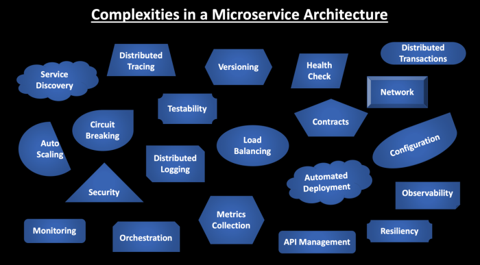
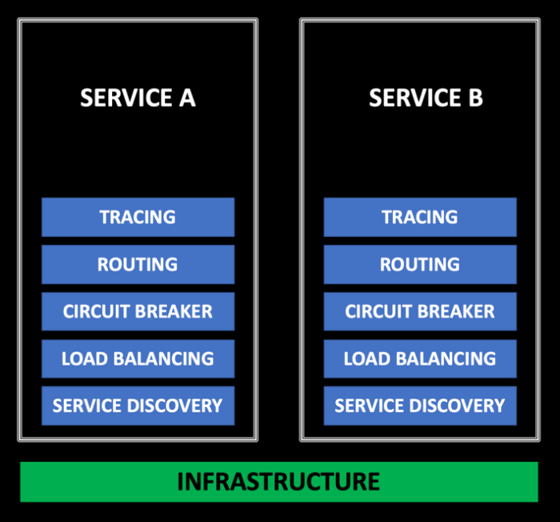
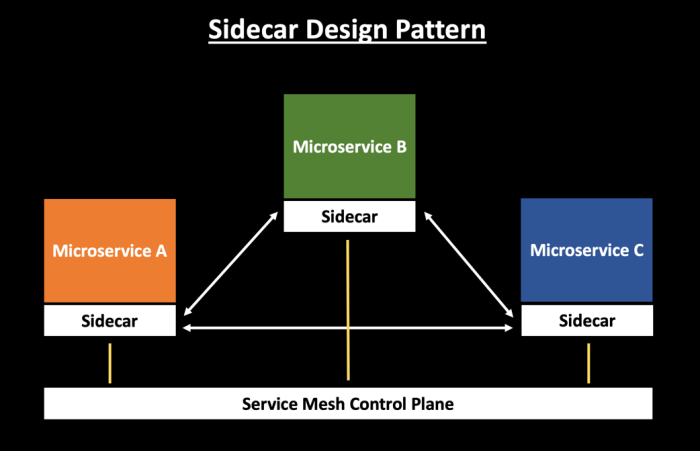
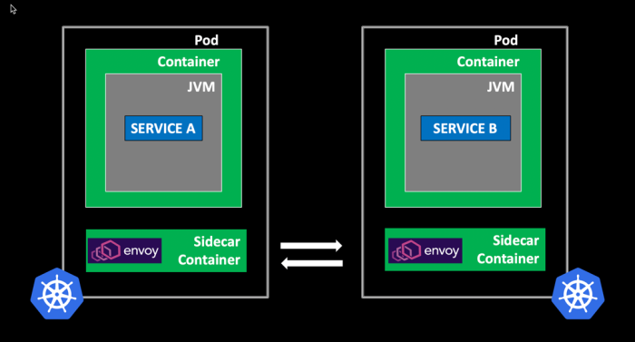
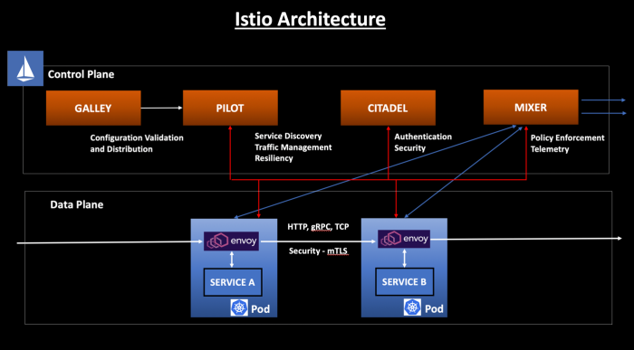

# 从Netflix OSS到Istio Service Mesh的微服务之旅

  _在这篇文章中，我们从Netflix开始，通过Envoy和Istio的崛起，快速浏览微服务的历史._

  微服务是具有边界上下文的松散耦合服务，使您能够独立开发，部署和扩展服务。它还可以定义为构建独立开发和部署的分布式系统的架构模式。 在微服务架构中处理服务之间的通信是一项挑战，因为它们需要在不可靠的网络中相互通信。

## 1. 微服务架构的复杂性

  分布式应用的一个问题是它们通过网络进行通信 - 这是不可靠的。因此，您需要以容错的方式设计您的微服务，并能够优雅地处理故障。 在您的微服务架构中，可能有很多服务相互通信。 您需要确保一个服务宕机了，不会导致整个架构崩溃。

  微服务架构中有许多组件，因此这会带来更多的故障点。 故障可能由多种原因引起 - 代码中的错误和异常，新代码的发布，部署问题，硬件故障，数据中心故障，不良的架构，缺乏单元测试，不可靠的网络通信，服务的依赖， 等等

  

## 2. Netflix OSS to the Rescue

  Netflix是最早采用微服务的公司之一。 为了跟上其增长速度，Netflix决定从庞大而单一的数据中心转向基于云的微服务架构，以实现高可用，大规模和速度。基于其成功案例，Netflix开源了许多工具/技术，为微服务架构提供支持。这些工具和组件已经成为许多企业从单体应用架构到微服务架构的驱动力。

  Netflix OSS是Netflix开源的一组库和框架，用于解决设计大规模分布式系统的问题。 阅读有关Netflix开源软件中心的更多信息[here](https://netflix.github.io/).

  Spring Boot可以轻松创建独立的、生产级的基于Spring的应用程序。 阅读更多有关信息[here](https://spring.io/projects/spring-boot).

  通过一些简单的注释，您可以快速启用和配置应用程序内的通用模块，并使用经过实战考验的Netflix组件构建大型分布式系统。 提供的模块包括服务发现(Eureka), 断路器 (Hystrix), 智能路由（Zuul）和客户端负载平衡（Ribbon）。

  

### 2.1. Netflix OSS的问题

- Netflix库与Java平台紧密耦合，如果您在Java平台中开发服务，它们非常适合。但是，在多语言架构中，您需要查找Netflix之外的库来处理服务之间的通信。

- Netflix库需要嵌入到每一个微服务中，并附带业务功能。这会导致应用程序膨胀，因为您需要在所有服务中复制类似的代码。

- 同时具有业务逻辑和基础架构逻辑会增加整体应用程序的复杂性。

- 由于您现在需要处理Netflix组件的修补/升级，因此也增加了操作复杂性。

- 需要额外的工具来提高微服务体系结构的监控性。

  

## 3. 什么是Sidecar设计模式

  sidecar 设计模式在云原生社区中越来越受欢迎并得到更广泛的采用。 构建具有高度可扩展性，弹性，安全性和可监控性的微服务架构具有挑战性。 Service Mesh架构的发展已经改变了游戏规则。它将与微服务架构相关的复杂性转移到单独的基础架构层，并提供许多功能，如负载平衡，服务发现，流量管理，断路，遥测，故障注入等。

  

## 3.1. 使用Sidecar模式的好处

- 通过抽象与基础架构相关的常见功能到不同的层，降低了微服务代码的复杂性。
- 减少微服务架构中的代码重复，因为您不需要在每个微服务中编写配置代码。
- 提供应用程序代码和底层平台之间的松散耦合。

## 3.2. 如何实现Service Mesh

  要实现服务网格，您可以在服务旁边部署代理。这也被称为`Sidecar`模式.。Sidecars从应用程序中抽象出复杂性，并处理服务发现，流量管理，负载平衡，断路器等功能。

  来自Lyft的[Envoy](https://www.envoyproxy.io/)是为云原生应用程序设计的最流行的开源代理。 Envoy与每项服务并行运行，并以平台无关的方式提供必要的功能。服务的所有流量都通过Envoy代理流通。

  

## 4. Istio 架构

  Istio是一个非常受欢迎的Service Mesh框架，它默认使用Lyft的Envoy作为sidecar代理。Sidecar与每个服务实例一起部署，它提供了一个界面来处理服务发现，负载平衡，流量管理，内部服务通信，监控等功能。Service Mesh为您提供了不再将服务与服务之间的通信作为你应用程序代码的一部分的自由。您可以让Service Mesh为您处理这种复杂性，而不是使您的微服务具有类似的功能。

  Istio Service Mesh由两个主要组件组成：

- 控制面板的职责是管理和配置sidecar代理以实施策略并收集遥测数据。

- 数据面板的职责是处理服务之间的通信，并负责服务发现，负载均衡，流量管理，健康检查等功能。

  

  请参阅我的其他博客文章，了解有关Istio控制平面和数据平面的更多信息：

- [Istio Service Mesh Control Plane](https://dzone.com/articles/istio-service-mesh-control-plane)
- [Istio Service Mesh Data Plane](https://dzone.com/articles/istio-service-mesh-data-plane)

> 原文： https://dzone.com/articles/microservices-journey-from-netflix-oss-to-istio-se

> 作者：[Samir Behara](https://dzone.com/users/3412089/samirbehara.html)

> 译者：[KeepGoingPawn](https://github.com/KeepGoingPawn)